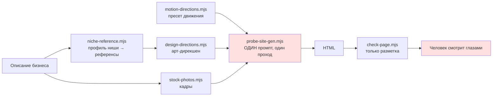
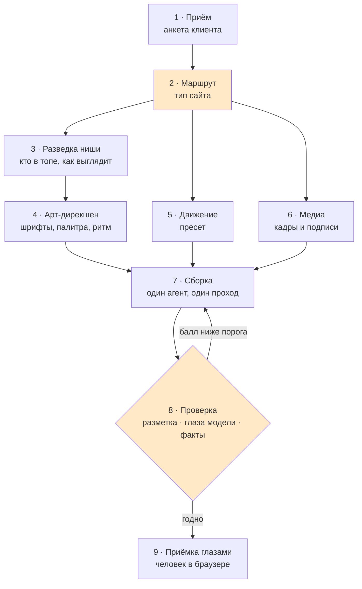

> Что это: методология создания сайта — конвейер из девяти этапов, где у каждого этапа
> один хозяин-скилл, один вход, один выход и одна проверка. Для кого: для нас, чтобы
> каждый новый сайт собирался одинаково, и для клиента, чтобы результат не зависел от
> настроения модели. Цепочка: анализ → **эта архитектура** → ТЗ. Ожидает одобрения владельца.

# Методология «Сайт под ключ»: этапы, хозяева, проверки

## 1. Что это и зачем

Сегодня сайт рождается за один вызов модели: в промпт складываются описание бизнеса,
арт-дирекшен, пресет движения и фотографии, и модель одним выстрелом выдаёт HTML.
Пока ниша знакомая, это работает. Как только меняется тип бизнеса — а стоматология,
фотограф и автосервис устроены по-разному, — начинаются осечки: структура секций у всех
одна, тип разметки модель выбирает на глаз, качество результата никто не измеряет,
кроме человека, смотрящего в браузер.

Методология превращает один выстрел в **конвейер**: девять этапов, у каждого хозяин,
вход, выход и проверка. Тип сайта выбирается на втором этапе и дальше определяет всё:
какие секции, какая разметка, какие кадры, какое движение.

## 2. Как сегодня (от чего отталкиваемся)



Что уже честно работает: профиль ниши (шесть профилей — картинка, еда, здоровье,
документы, техника, обучение), одиннадцать арт-дирекшенов, шесть пресетов движения,
слой фото и видео, проверка разметки.

Что не работает: **структура страницы одна на всех** (`DEFAULT_STRUCTURE`, восемь секций),
тип разметки JSON-LD модель выбирает сама, качество меряется только человеком, а после
осечки страница переделывается целиком.

## 3. Что делаем (решение простыми словами)

Три изменения, всё остальное — уже написанное, расставленное по местам.

**Первое: тип сайта становится явным решением.** Не «профиль ниши для референсов», а
маршрут: набор секций, тип разметки, обязательные слоты медиа, дирекшен и пресет движения.
Четыре маршрута покрывают то, что мы уже делали.

**Второе: у страницы появляются глаза.** После сборки страница рендерится, снимается
скриншот, модель со зрением ставит балл и перечисляет дефекты, страница пересобирается,
берётся лучшая версия из трёх. Это единственное, что в проходе `find-new` было измерено:
+96% точности и внешний вид с 3.0 до 3.9 на WebGen-Agent, независимо +17.8% за три цикла
на WebDev Arena.

**Третье: проверка фактов становится отдельным этапом, а не строкой промпта.** Каждое
утверждение на странице сверяется со строкой брифа. Нет строки — плейсхолдер.

**Чего сознательно НЕ делаем: не разбиваем сборку на агентов-специалистов.** Обоснование
в разделе 7, развилка Р1.

### Чем это подтверждается у других

| Кто | Что делает так же | Что забираем дословно |
|---|---|---|
| `AgricIDaniel/claude-seo` — 25 под-скиллов, 18 агентов | Определяет **вертикаль бизнеса** (SaaS · локальный · магазин · издатель · агентство) и маршрутизирует проверки по ней — это наш этап 2, сделанный до нас | Окно цитируемости абзаца **134–167 слов**; линтер устаревших типов разметки (`HowTo` снят, а модель его всё ещё любит); базовый аудит работает без единого платного ключа |
| `rhelmer.org` — практик, держит сайты на агентах | Проверка через **скоркарту со взвешенными баллами**: читаемость, корректность, безопасность, SEO/AI — это наш этап 8 | Правки приходят комментарием с предложением, а не коммитом: человек остаётся в петле, история репозитория чистая |
| `BMAD-METHOD`, 49k★ | Аналитик → PM → Архитектор → Скрам-мастер → Разработчик → QA, передача файлом-историей | Ничего нового: это ровно цепочка §6 нашего `CLAUDE.md`. Подтверждает, что роли живут **на уровне процесса разработки**, а не внутри сборки одной страницы |
| `wshobson/agents` 36.7k★, `VoltAgent` 154 агента | Каталоги ролей: frontend-developer, ui-designer, seo-specialist, accessibility-tester | Не роли, а **разнесение по моделям**: Opus на архитектуру и ревью, Sonnet на тесты, Haiku на SEO и деплой |

## 4. Как это будет выглядеть

### Конвейер целиком



Оранжевым — то, чего сегодня нет. Всё остальное существует и просто встаёт в очередь.

### Кто отвечает за что

| # | Этап | Хозяин | Вход | Выход | Проверка |
|---|---|---|---|---|---|
| 1 | Приём | скилл `idea-interviewer` (есть) | слова клиента | бриф: факты дословно, пустые поля помечены «нет» | ни одного поля «додумано» |
| 2 | Маршрут | `tools/site-routes.mjs` (**новое**) | бриф | тип сайта → секции, тип разметки, слоты, дирекшен, движение | тип назван явно, не «общий случай» |
| 3 | Разведка ниши | скилл `niche-benchmark` + `niche-reference.mjs` (есть) | ниша и город | `references/niches/<ниша>.json` | 4 живых сайта разобраны или честное «источник не ответил» |
| 4 | Арт-дирекшен | скилл `find-new` + `design-directions.mjs` (есть) | профиль ниши, референс владельца | шрифты, палитра, композиция, деталь | дирекшен назван, не смешан с другим |
| 5 | Движение | скилл `motion-direction` (есть) | тип сайта | пресет + список приёмов | вопрос задан владельцу **до** генерации |
| 6 | Медиа | `stock-photos.mjs`, `stock-video.mjs` (есть) | сюжеты слотов | кадры + подписи по типу кадра | ни одного имени и бренда из референса |
| 7 | Сборка | `probe-site-gen.mjs` (есть) | всё выше | HTML одним файлом | документ разобран, `<!DOCTYPE>` на месте |
| 8 | Проверка | `check-page.mjs` (есть) + `page-critic.mjs` (**новое**) + `fact-check` (**новое**) | HTML + бриф | балл, список дефектов, вердикт по фактам | ниже порога — пересборка, лучшая из трёх |
| 9 | Приёмка | скилл `qa-user-tester` (есть) | ссылка | вердикт человека | клики в браузере, а не чтение кода |

Из девяти этапов **шесть уже написаны**. Новых три: маршрут, критик со зрением,
проверка фактов.

### Четыре маршрута — четыре разных сайта

| Маршрут | Кто это | Секции сверх базовых | Разметка | Медиа | Дирекшен по умолчанию | Движение |
|---|---|---|---|---|---|---|
| **Услуга рядом** | стоматология, автосервис, клининг, сантехник | зона обслуживания, порядок работы шагами, вопросы-ответы 6 штук | `LocalBusiness` нужного подтипа + `FAQPage` | до 4 кадров, работа и место | `clinical` / `industrial` | `landing` |
| **Работа глазами** | фотограф, тату, флорист, интерьер | галерея слотов с подписями, «как проходит съёмка», география работы | `ProfessionalService` + `FAQPage` | галерея обязательна, слоты из Cosmos | `gallery` / `editorial` | `story` |
| **Товар и место** | кофейня, пекарня, мастерская, мебель | витрина товара, где нас найти, состав и материал | `LocalBusiness` + `Product` без цены, если цены нет во входе | продукт в действии, крупный план | `organic` / `productstage` | `showcase` |
| **Специалист** | юрист, бухгалтер, психолог, репетитор | о специалисте, с чем приходят, порядок работы | `Person` + `ProfessionalService` + `FAQPage` | портрет-слот, документы не выдумываем | `formal` → `swiss` / `luxe` | `interface` |

Маршрут не догадка: он выбирается по тому же тексту, по которому сегодня выбирается
профиль ниши в `nicheProfile()`, — код для этого уже есть, ему добавляется вторая
половина ответа.

### Живой образец: «автосервис, только для японских машин, Казань»

```
1  Приём      →  бриф: дело=автосервис · город=Казань · специализация=японские авто
                 телефон=НЕТ · цены=НЕТ · стаж=НЕТ · адрес=НЕТ
2  Маршрут    →  «Услуга рядом» · AutoRepair + FAQPage · дирекшен industrial · движение landing
3  Разведка   →  профиль technical, 4 сайта разобраны, кэш references/niches/ уже лежит
4  Дирекшен   →  Bebas Neue + IBM Plex Sans, графит #1C1C1C, сигнальный оранжевый
5  Движение   →  пресет landing, 10 приёмов, вопрос владельцу задан
6  Медиа      →  4 кадра: цех, руки на двигателе, инструмент, машина на подъёмнике
7  Сборка     →  artifacts/.../avtoservis-kazan.html
8  Проверка   →  разметка: H1 один, FAQPage есть, JSON-LD AutoRepair — ок
                 глаза: 3.4 из 5 — «шапка наезжает на первый экран на 390px» → пересборка
                 глаза: 4.1 из 5 — берём эту версию
                 факты: 12 утверждений, 12 подтверждены брифом, 4 плейсхолдера на месте
9  Приёмка    →  владелец кликает, говорит «годно»
```

## 5. Делаем поверх существующего (масштаб)

Переиспользуем целиком: `nicheProfile`, `design-directions`, `motion-directions`,
`stock-photos`, `stock-video`, `check-page`, `reference-tokens`, `niche-reference`,
все девять скиллов цепочки.

Добавляем три вещи:

- `tools/site-routes.mjs` — таблица четырёх маршрутов и функция выбора по описанию.
  Соседний файл `niche-reference.mjs` устроен ровно так же, формат берётся оттуда.
- `tools/page-critic.mjs` — рендер, скриншот, вопрос модели по опубликованной рубрике,
  балл и дефекты, best-of-3 вокруг `probe-site-gen.mjs`.
- Скилл `fact-check` — сверка каждого утверждения страницы со строкой брифа; это
  исполняемая форма инварианта `no-invented-facts`, который сейчас живёт только текстом
  в промпте.

Честная оценка: маршруты — день, критик — два дня вместе с рубрикой, проверка фактов —
день. Ни один существующий файл не переписывается, `DEFAULT_STRUCTURE` заменяется
структурой маршрута.

## 6. Границы — что НЕ делаем

- **Не разбиваем сборку на агентов-специалистов** (копирайтер, верстальщик, SEO). Причина
  и доказательство — Р1. Вернёмся, если критик покажет, что дефекты кучкуются в одной
  области.
- **Не дообучаем модель.** ReLook и работа CHI-2026 дают выигрыш через обучение — это не
  наш инструмент, работаем на готовой модели.
- **Не строим многостраничник.** Маршруты описывают одну страницу; страницы под города
  лежат в реестре не-сделанного с 2026-08-10.
- **Не берём чужие харнессы целиком.** У WebGen-Bench 647 автотестов, они про
  веб-приложения, а не про посадочные страницы; берём рубрику оценки, не набор задач.

## 7. Дорешал сам

| # | Решил | На чём стою |
|---|---|---|
| Р1 | Сборку оставляем одному агенту, качество берём петлёй проверки, а не веером ролей | Измерено: петля со зрением даёт +96% точности (WebGen-Agent) и +17.8% за три цикла (WebDev Arena). У ролевых схем — CrewAI landing page generator, AgentCanvas, вендорские «13 агентов» — не опубликовано ни одного сравнения с одним промптом. Anthropic прямо пишет: на задачах с общим контекстом и сильными связями веер проигрывает одному агенту и стоит 15× токенов; страница — ровно такой контекст. **Контр-проверка:** будь роли выигрышем, у вендоров были бы числа против одного промпта; их нет ни у одного. **Цена ошибки:** роли — переписать генератор и платить 15× без доказательства; петля — надстройка, откатывается удалением шага |
| Р2 | Маршрутов четыре, а не шесть под каждый профиль ниши | Профиль ниши отвечает на «как выглядит», маршрут — на «из чего состоит». Профили `care` и `formal` дают разную картинку, но одинаковый скелет страницы: услуга, шаги, вопросы, контакты. Плодить маршрут на профиль — размножать одинаковые таблицы |
| Р3 | Рубрика критика — половина чужая, половина своя | Изначально решил брать опубликованную целиком: рубрики WebGen-Bench и WebDev Arena сверены с человеческими оценками, своя ни с чем не сверена. Практик с `rhelmer.org` возражает по делу: скоркарта под свой репозиторий достовернее общей метрики. Разрешаю так: общая часть — читаемость, корректность, вид — берётся опубликованная, к ней добавляются наши инварианты, которых нет ни в одной чужой рубрике: город на месте, плейсхолдеры видны, ни одного выдуманного факта |
| Р4 | Порог пересборки — три попытки, берём лучшую | Обе работы мерили ровно три цикла и дальше не смотрели; ставить больше — платить за неизмеренное |
| Р5 | Этапы разносим по моделям, а не по ролям | У `wshobson/agents` (36.7k★) и VoltAgent в YAML каждого агента поле `model`: Opus на архитектуру и ревью, Haiku на SEO и деплой. Применяем к этапам: сборка (7) — сильная модель, разведка и медиа (3, 6) и разбор разметки (8) — дешёвая. Роли при этом не заводятся, делится нагрузка, а не ответственность |
| Р6 | Проверка цитируемости получает число: абзац 134–167 слов | Взято из `claude-seo`, где это записано как рабочее окно для попадания абзаца в ответ нейросети. Сегодня у нас в промпте «ответы короткие и пригодные к цитированию» — оценочное суждение, которое нечем проверить |

## 8. Что реши ты (открытые развилки)

> **Развилка 1. Кто судья на этапе 8 — модель или человек.** Рекомендую модель с порогом
> и человека только на девятом этапе, потому что иначе конвейер упирается в твоё время на
> каждой пересборке. Не так — поправь, тогда критик выдаёт отчёт, а решение о пересборке
> принимаешь ты.
>
> **Развилка 2. Что делать, когда критик трижды не дотянул до порога.** Рекомендую отдавать
> лучшую версию с честной строкой «страница собрана, но по виду слабее обычного»: пустая
> выдача хуже слабой. Не так — поправь, тогда генератор возвращает отказ.
>
> **Развилка 3. Четыре маршрута — те ли.** Они выведены из ниш, которые мы уже делали:
> стоматология, фотограф, автосервис. Если у тебя на примете другой тип клиента —
> назови, добавлю пятый до того, как таблица закаменеет.

## 9. Как поймём, что получилось (критерии приёмки)

- Два сайта из разных маршрутов, собранные подряд, отличаются структурой и разметкой, а
  не только шрифтом и цветом.
- На вопрос «почему тут именно эти секции» есть ответ строкой маршрута, а не «так решила
  модель».
- Страница, которую критик отверг, действительно выглядит хуже принятой — проверяется
  вручную на пяти парах, иначе балл не значит ничего.
- Ни одного утверждения на готовой странице, которого нет в брифе; каждое отсутствующее
  данное — видимый плейсхолдер.
- Владелец на девятом этапе говорит «годно» без правок структуры.

## 10. Связи

- Проход по рынку и статьям: `second-brain/01_projects/research-journal.md`, строки 2026-08-11
- Инвариант фактов: `second-brain/02_architecture/no-invented-facts.md`
- Слой движения: `second-brain/02_architecture/motion-layer.md`
- Дальше → ТЗ: `plans/tz/2026-08-11-site-pipeline.md` (пишется ПОСЛЕ `status: approved`)

---

<!-- ПРОТОКОЛ ОДОБРЕНИЯ (не удаляй):
  1. Агент готовит документ, оставляет status: draft.
  2. Владелец читает раздел 4 («как будет выглядеть») и разделы 7–9.
  3. Владелец говорит «да / одобряю» → ВЛАДЕЛЕЦ (или агент с его явного разрешения) ставит
     status: approved и проставляет approved_at.
  4. Только после этого открывается стадия tz. Агент сам approved не ставит. -->
